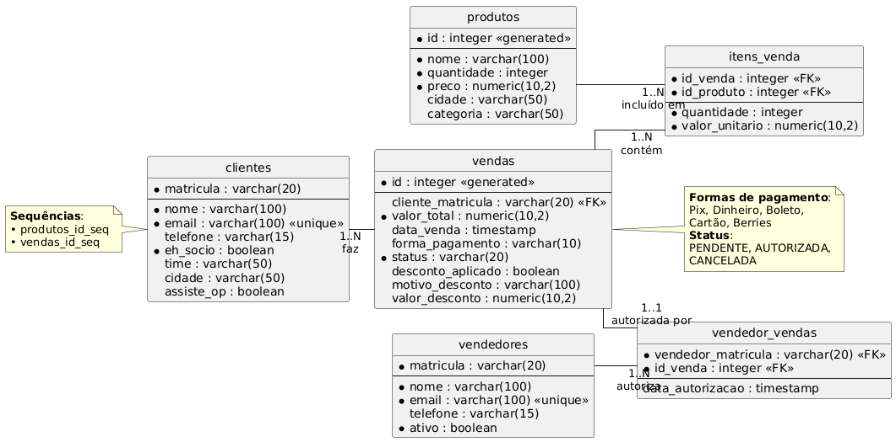

  
  

# CRUD System for Athletic Organization Products

A management system for university athletic organizations featuring customer registration, inventory control, and sales processing. Developed as a project for Database I course at **Universidade Federal da Paraíba** for the **Associação Atlética Acadêmica do Centro de Informática (Compilada)**.

## Entity-Relationship Diagram

  

## Key Features

### Customer Management
- **Student ID** as the primary key  
- **Membership status** tracking  
- **Automatic discounts** for members  

### Product Management
- **Real-time inventory control**  
- **Low-stock alerts**  
- **Price management**  

### Sales Processing
- **Multi-item transactions**  
- **PIX & Cash payment support**  
- **Automated reporting**  

## Technology Stack

| Component       | Technology           |
|---------------|----------------------|
| **Backend**   | Python 3.10+         |
| **Database**  | PostgreSQL 14+       |
| **DB Connector** | psycopg2          |
| **Config Manager** | python-dotenv  |

## Contributors

| [**Gabriel Campelo Formiga**](https://www.linkedin.com/in/gabrielcformiga/) | [**Mateus Freitas Correia**](https://www.linkedin.com/in/mateus-freitas-correia/) |
|:------------------------------------------------------------------:|:------------------------------------------------------------------:|
|  |  |
| [GitHub: GabrielCFormiga](https://github.com/GabrielCFormiga) | [GitHub: MateusFreitas-C ](https://github.com/MateusFreitas-C) |
